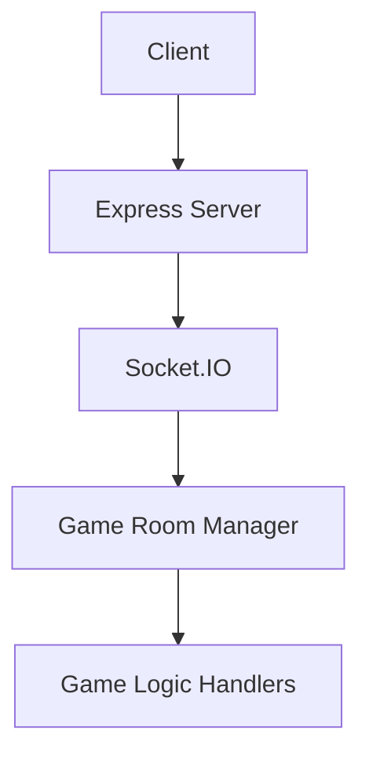

# Multiplayer Game System Technical Report

## Project Overview
Multiplayer gaming system supporting 25+ game types including:
- Guess The Sketch
- Bingo Bash
- Tic Tac Toe
- Word Search
- Warship Royale

## System Architecture


## Key Components
1. **Room Management System**
   - Supports 8 concurrent public rooms
   - Private room creation capability
   - Player capacity limits per game type

2. **Network Layer**
   - Socket.IO for real-time communication
   - Connection timeout handling (25s)
   - Automatic reconnection logic

3. **Game Services**
   - Player matchmaking system
   - Game state synchronization
   - Cross-client event broadcasting

## Installation & Usage
```bash
npm install
npm start
```

## Dependencies
- Express v4.17.1
- Socket.IO v4.5.1
- Node.js v14+

## Version History
1.1.0 - Initial release with core multiplayer functionality